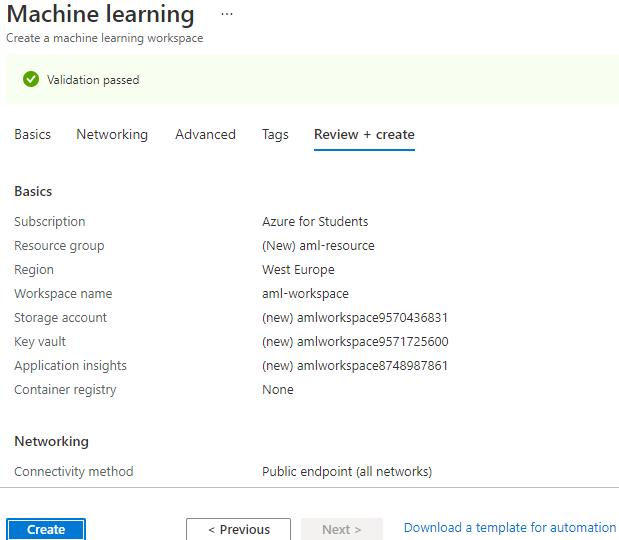
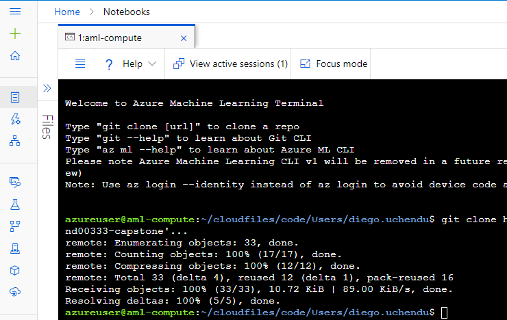

# Predicting mortality by heart failure using Microsoft Azure
An Udacity Project part of the Machine Learning Engineer with Microsoft Azure Nanodegree program. 
I will start by getting the Heart failure dataset into Azure datastore, then create 2 models, one using AutoML and the other using HyperDrive,Compare there performance, Deploy Best Model and Test Model End Point.

## Project Set Up and Installation
*OPTIONAL:* If your project has any special installation steps, this is where you should put it. To turn this project into a professional portfolio project, you are encouraged to explain how to set up this project in AzureML.

Using my Azure account, I created a machine learning workspace within a Resource group.

Then within Azure ML studio, I have to provision a compute instance Standard_DS3_v2(4 cores,14GB RAM, 28GB storage, cost $0.27/hr)

Next is I created a Notebook,then cloned starter files from github repository via Azure Machine Learning CLI terminal

## Dataset

### Overview
*TODO*: Explain about the data you are using and where you got it from.
Heart failure is a common event caused by Cardiovascular diseases (CVDs) dataset contains 12 features that can be used to predict mortality by heart failure.[source kaggle](https://www.kaggle.com/datasets/andrewmvd/heart-failure-clinical-data)

### Task
*TODO*: Explain the task you are going to be solving with this dataset and the features you will be using for it.
This is a binary classification problem to predict "DEATH_EVENT". 

### Access
*TODO*: Explain how you are accessing the data in your workspace.

## Automated ML
*TODO*: Give an overview of the `automl` settings and configuration you used for this experiment

### Results
*TODO*: What are the results you got with your automated ML model? What were the parameters of the model? How could you have improved it?

*TODO* Remeber to provide screenshots of the `RunDetails` widget as well as a screenshot of the best model trained with it's parameters.

## Hyperparameter Tuning
*TODO*: What kind of model did you choose for this experiment and why? Give an overview of the types of parameters and their ranges used for the hyperparameter search

### Results
*TODO*: What are the results you got with your model? What were the parameters of the model? How could you have improved it?

*TODO* Remeber to provide screenshots of the `RunDetails` widget as well as a screenshot of the best model trained with it's parameters.

## Model Deployment
*TODO*: Give an overview of the deployed model and instructions on how to query the endpoint with a sample input.

## Screen Recording
*TODO* Provide a link to a screen recording of the project in action. Remember that the screencast should demonstrate:
- A working model
- Demo of the deployed  model
- Demo of a sample request sent to the endpoint and its response

## Standout Suggestions
*TODO (Optional):* This is where you can provide information about any standout suggestions that you have attempted.

## References

1. [Udacity ML Engineer for microsoft azure nanodegree](https://www.udacity.com/course/machine-learning-engineer-for-microsoft-azure-nanodegree--nd00333)
2. [Kaggle Dataset](https://www.kaggle.com/datasets/andrewmvd/heart-failure-clinical-data)
3. 