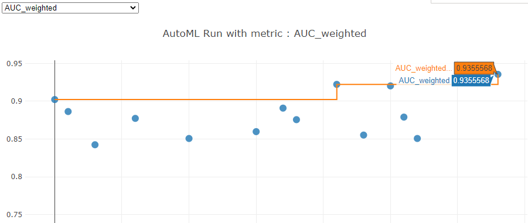
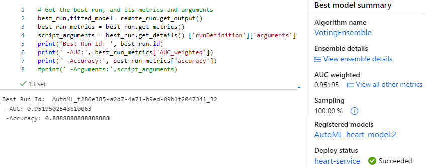

# Predicting mortality by heart failure using Microsoft Azure
An Udacity Project part of the Machine Learning Engineer with Microsoft Azure Nanodegree program. 
I will start by getting the Heart failure dataset into Azure datastore, then create 2 models, one using AutoML and the other using HyperDrive,Compare there performance, Deploy Best Model and Test Model End Point.


## Project Set Up and Installation
*OPTIONAL:* If your project has any special installation steps, this is where you should put it. To turn this project into a professional portfolio project, you are encouraged to explain how to set up this project in AzureML.

Using my Azure account, I created a machine learning workspace within a Resource group.


Then within Azure ML studio, I have to provision a compute instance Standard_DS3_v2(4 cores,14GB RAM, 28GB storage, cost $0.27/hr)

Next is I created a Notebook,then cloned starter files from github repository via Azure Machine Learning CLI terminal


## Dataset


### Overview
*TODO*: Explain about the data you are using and where you got it from.
Heart failure is a common event caused by Cardiovascular diseases (CVDs) dataset contains 12 features that can be used to predict mortality by heart failure.[source kaggle](https://www.kaggle.com/datasets/andrewmvd/heart-failure-clinical-data)

### Task
*TODO*: Explain the task you are going to be solving with this dataset and the features you will be using for it.
This is a binary classification problem to predict "DEATH_EVENT". 

### Access
*TODO*: Explain how you are accessing the data in your workspace.
The csv data from kaggle was uploaded to Azure datastore. then I created a tabular dataset on the datastore, before registering the tabular dataset.

```python
default_ds = ws.get_default_datastore()

#FileDatasetFactory.upload_directory
if 'Heart Failure' not in ws.datasets:
    default_ds.upload_files(files=['./heart_failure_clinical_records_dataset.csv'], # Upload the diabetes csv files in /data
                        target_path='data/', # Put it in a folder path in the datastore
                        overwrite=True, # Replace existing files of the same name
                        show_progress=True)

    #Create a tabular dataset from the path on the datastore (this may take a short while)
    tab_data_set = Dataset.Tabular.from_delimited_files(path=(default_ds, 'data/*.csv'))

    # Register the tabular dataset
    try:
        tab_data_set = tab_data_set.register(workspace=ws, 
                                name='Heart Failure',
                                description='Clinic data',
                                tags = {'format':'CSV'},
                                create_new_version=True)
        print('Dataset registered.')
    except Exception as ex:
        print(ex)
else:
    print('Dataset already registered.')
```

After registeration is done, you can now access the datastore using registered name.

```python
heart_ds = ws.datasets.get("Heart Failure")
```

## Automated ML
*TODO*: Give an overview of the `automl` settings and configuration you used for this experiment

AutoML is used to train and tune a model.

* This is a classification task as we want to predict is someone will die of heart failure or not, thus label_column_name is "DEATH_EVENT".
* maximum time for the experiment was set to 15 minutes
* primary metric for classification here is AUC_Weighted, used to optimize for model selection.
* featurization, data imputation, one-hot-encoding,e.t.c will be performed automatically or not.
* 5 max concurrt iterations is set, But I provisioned maximum of 2 nodes for my compute cluster, thus other runs will be queued.
* early stopping is true, thus we can terminate  is no improvement in short term.
* debug_log, the log file to write debug information is specified here.
* training and validation data are specified there, respectively.
  
```python
#from azureml.train.automl import AutoMLConfig

# TODO: Put your automl settings here
automl_settings = {
    "experiment_timeout_minutes": 15,
    "max_concurrent_iterations": 5,
    "primary_metric" : 'AUC_weighted'
}

# TODO: Put your automl config here
automl_config = AutoMLConfig(compute_target=training_cluster,
                             task = "classification",
                             training_data=train_ds,
                             validation_data = test_ds,
                             label_column_name="DEATH_EVENT",   
                             #path = experiment_folder,
                             enable_early_stopping= True,
                             featurization= 'auto',
                             debug_log = "automl_errors.log",
                             **automl_settings

)
```

### Results
*TODO*: What are the results you got with your automated ML model? What were the parameters of the model? How could you have improved it?
After runing the AutoML model for 15 minutes, Result shows weighted AUC and Accuracy.

|AUC|Accuracy|
|--|--|
|AUC: 0.952|0.88|

This result above can be improved by increasing the experiment timeout minutes parameter in `AutoMLConfig`.

*TODO* Remeber to provide screenshots of the `RunDetails` widget as well as a screenshot of the best model trained with it's parameters.

The diagrams below shows the `RunDetails`widgets of machine learning pipelines and AUC_weighted while the experiment was still running.




best model trained is VotingEnsemble with it's parameters.



7 ensemble algorithms where involved in training. It takes the parameters of th ensemble algorithm.
e.g. logistic regression as one of the ensemble algorithm applied 4 parameters for training.

```json
{
    "class_name": "LogisticRegression",
    "module": "sklearn.linear_model",
    "param_args": [],
    "param_kwargs": {
        "C": 0.3906939937054613,
        "class_weight": null,
        "multi_class": "ovr",
        "penalty": "l1",
        "solver": "saga"
    },
    "prepared_kwargs": {},
    "spec_class": "sklearn"
}
```


Time is the most important feature for predicting death by heart failure with feature importance of 0.857.


## Hyperparameter Tuning
*TODO*: What kind of model did you choose for this experiment and why? Give an overview of the types of parameters and their ranges used for the hyperparameter search


### Results
*TODO*: What are the results you got with your model? What were the parameters of the model? How could you have improved it?

|AUC|Accuracy|
|--|--|
|AUC: 0.927|0.83|

*TODO* Remeber to provide screenshots of the `RunDetails` widget as well as a screenshot of the best model trained with it's parameters.

## Model Deployment
*TODO*: Give an overview of the deployed model and instructions on how to query the endpoint with a sample input.

## Screen Recording
*TODO* Provide a link to a screen recording of the project in action. Remember that the screencast should demonstrate:
- A working model
- Demo of the deployed  model
- Demo of a sample request sent to the endpoint and its response

## Standout Suggestions
*TODO (Optional):* This is where you can provide information about any standout suggestions that you have attempted.

## References

1. [Udacity ML Engineer for microsoft azure nanodegree](https://www.udacity.com/course/machine-learning-engineer-for-microsoft-azure-nanodegree--nd00333)
2. [Kaggle Dataset](https://www.kaggle.com/datasets/andrewmvd/heart-failure-clinical-data)
3. [Register Dataset](https://github.com/MicrosoftLearning/mslearn-dp100/blob/main/06%20-%20Work%20with%20Data.ipynb)
4. [AutoMLConfig](https://docs.microsoft.com/en-us/python/api/azureml-train-automl-client/azureml.train.automl.automlconfig.automlconfig?view=azure-ml-py)
5. [OVR vs OVO](https://machinelearningmastery.com/one-vs-rest-and-one-vs-one-for-multi-class-classification/)